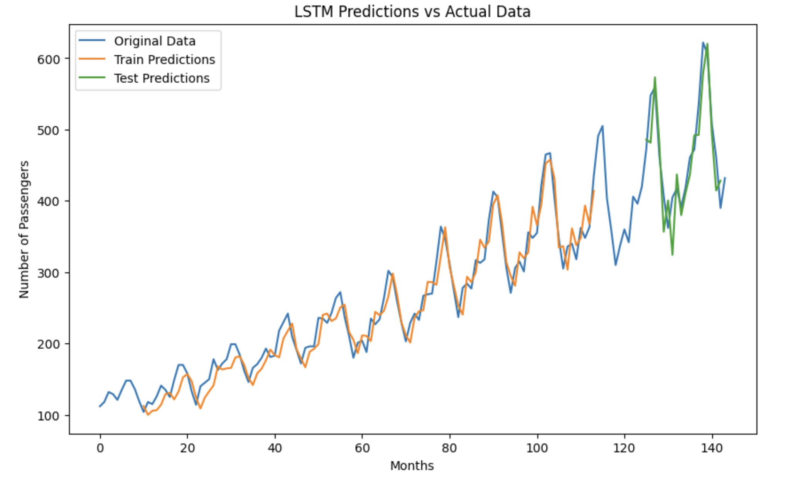

# Time Series Forecasting: Airline Passenger Counts

This project explores **time series forecasting** techniques for predicting monthly airline passenger counts. The dataset consists of **144 monthly observations** (shape: 144 × 2) and serves as a hands-on exercise to understand and compare two popular approaches: **Facebook Prophet** and **LSTM** (Long Short-Term Memory) networks.

---

## Table of Contents
1. [Overview of the Data](#overview-of-the-data)  
2. [Prophet Modeling](#prophet-modeling)  
3. [LSTM Approach](#lstm-approach)  
4. [Results & Visualization](#results--visualization)  
5. [Key Insights](#key-insights)  
6. [Future Improvements](#future-improvements)

---

## Overview of the Data
- **Dataset**: Monthly passenger counts (144 data points).
- **Frequency**: Monthly intervals.
- **Goal**: Predict future passenger volumes based on historical patterns.

The data can be **slow to change**, which sometimes leads to overfitting. Nonetheless, it provides a valuable platform to practice both **traditional** and **deep learning** time series methods.

---

## Prophet Modeling
**Facebook Prophet** is a forecasting library designed for **trend** and **seasonality** analysis with minimal tuning.

1. **Visualization**: Plotted the monthly data to observe seasonal patterns and overall trends.  
2. **Model Training**: Fitted the Prophet model to the existing data, then created a future dataframe to generate predictions for upcoming months.  
3. **Components Analysis**: Examined the model’s interpretation of trend and seasonality using Prophet’s built-in visualization tools.

**Why Prophet?**  
- **Automatic Seasonality**: Prophet can detect yearly, weekly, and daily seasonality.  
- **Trend Analysis**: It provides insights into growth trends, which can be valuable for business decisions.  
- **Ease of Use**: Requires minimal configuration and is often a strong baseline for time series tasks.

---

## LSTM Approach
**Long Short-Term Memory (LSTM)** networks are a type of **recurrent neural network** well-suited for sequential data. They can remember long-term dependencies, making them effective for certain time series forecasting tasks.

1. **Data Reshaping**:  
   - Converted the data into a **2D array** to prepare it for scaling. This step is often required because many scaling libraries expect two-dimensional inputs (samples × features).  
   - Scaled the data (e.g., via MinMaxScaler) to normalize the passenger counts.  

2. **Sequence Generation**:  
   - Created sequences of length **time_step** (e.g., 10 months) to predict the passenger count of the following month.  
   - Split the data into **training** and **testing** sets (e.g., 80% train, 20% test).

3. **Model Architecture**:  
   - Utilized LSTM layers to capture temporal dependencies in the data.  
   - Followed by Dense layers at the end, **without** additional activation functions (e.g., ReLU), because the dataset appears **relatively linear** in behavior, and introducing non-linearity sometimes hurt performance.  

4. **Training**:  
   - Employed mean squared error (MSE) as the loss function.  
   - Trained for a suitable number of epochs, monitoring validation loss to prevent overfitting.

**Why LSTM?**  
- **Memory Cells**: Capable of learning longer sequences than traditional RNNs.  
- **Flexibility**: Can capture non-linear relationships if the data demands it.

---

## Results & Visualization
- **Prophet**: Plotted the forecast against actual data, visualizing trend and seasonality.  
- **LSTM**: Generated predictions on the test set and plotted them alongside the original time series to compare performance.

From the chart, you can see how well the model fits the underlying passenger trend. Though the dataset is small and prone to overfitting, it still provides insight into **sequential model training** and **evaluation**.

---

## Key Insights
1. **Overfitting**: Smaller datasets can lead to overfitting, especially with deep networks like LSTMs.  
2. **Non-Linearity**: Adding non-linear activations in the final layer did not always improve results, possibly due to the linear nature of this dataset.  
3. **Prophet vs. LSTM**: Prophet offers an intuitive view of trend and seasonality, while LSTM excels at learning complex patterns when sufficient data is available.

---

## Future Improvements
1. **Larger Dataset**: Incorporating more data points could help mitigate overfitting.  
2. **Hyperparameter Tuning**: Experimenting with different LSTM architectures, dropout rates, or optimizers might improve performance.  

---

