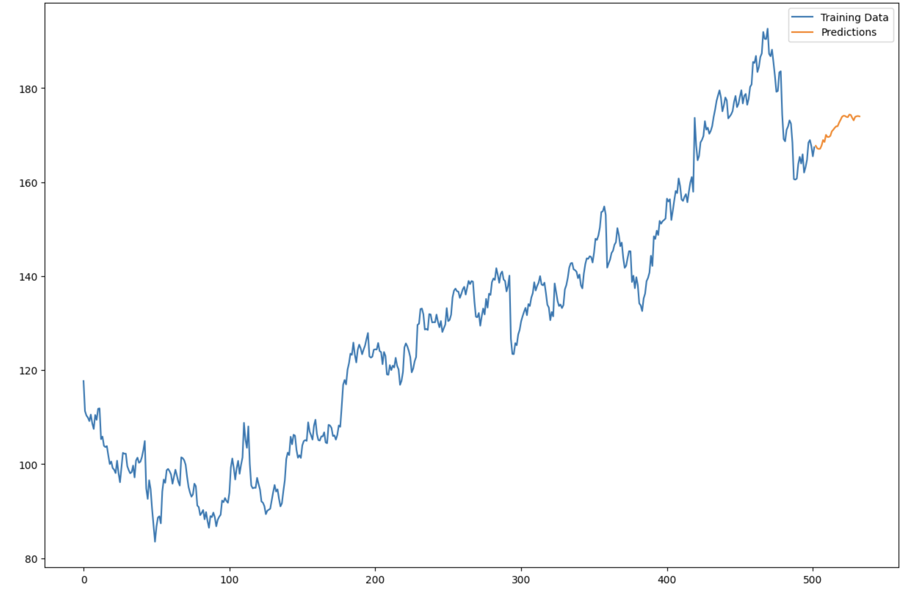

# Stock Price Forecasting

This repository demonstrates a **time series forecasting** approach for **Google stock data** using **ARIMA** and **SARIMAX** models. By applying classical time series techniques—such as **Augmented Dickey-Fuller (ADF)** tests, **Autocorrelation Function (ACF)** plots, and **differencing**—the project explores how to effectively model and predict stock price movements.

---

## Table of Contents
1. [Overview](#overview)  
2. [Data Acquisition](#data-acquisition)  
3. [Time Series Analysis](#time-series-analysis)  
   - [ADF Test](#adf-test)  
   - [ACF Plot](#acf-plot)  
   - [Differencing](#differencing)  
4. [ARIMA & SARIMAX Models](#arima--sarimax-models)  
5. [Results & Visualization](#results--visualization)  
6. [Key Insights](#key-insights)

---

## Overview
- **Goal**: Predict Google stock prices over a specified time range (from August 24, 2022, to August 24, 2024).  
- **Techniques**: Employed **ADF tests** to check stationarity, **ACF plots** to identify patterns, and experimented with **differencing** to stabilize the time series.  
- **Models**: Implemented both **ARIMA** and **SARIMAX** (Seasonal ARIMA) to compare performance.

---

## Data Acquisition
- **Data Source**: Fetched Google stock price data using the **Yahoo Finance** API.  
- **Timeframe**: From **2022-08-24** to **2024-08-24**, providing daily closing prices.  
- **Shape**: The dataset has **503 rows** (dates) and **6 columns**.

---

## Time Series Analysis

### ADF Test
The **Augmented Dickey-Fuller** (ADF) test checks whether a time series is stationary or not. A **stationary** series has constant statistical properties (mean, variance) over time.  
- **If p-value < 0.05**: We typically reject the null hypothesis, suggesting the series is stationary.  
- **If p-value ≥ 0.05**: We fail to reject the null hypothesis, indicating the series may be non-stationary.

### ACF Plot
The **Autocorrelation Function (ACF)** plot helps in:
1. **Assessing Stationarity**: A slow decay of correlations can imply non-stationary data.  
2. **Detecting Seasonality**: Repeating spikes at regular intervals suggest seasonal patterns.  
3. **Understanding Lag Correlations**: Shows how data points correlate at different lags.  
4. **Choosing p for ARIMA**: The lag at which the autocorrelation drops off can guide the AR (p) term.

### Differencing
**Differencing** subtracts the previous time step’s value from the current value, which can help remove trends or seasonality, making the series more stationary. However, **excessive differencing** can lead to loss of valuable information, and if the model is configured to handle differencing internally (e.g., `d` parameter in ARIMA), manual differencing might be unnecessary or even detrimental.

---

## ARIMA & SARIMAX Models

1. **ARIMA (Autoregressive Integrated Moving Average)**  
   - Initial approach used a configuration like **ARIMA(2,0,3)** on a differenced dataset.  
   - **AIC** and **BIC** were monitored to gauge model quality.  

2. **SARIMAX (Seasonal ARIMA)**  
   - A second approach used a **seasonal order** to account for recurring patterns over specific periods.  
   - Example: **order=(1,1,1)** with **seasonal_order=(2,1,3,30)** to capture monthly seasonality.  
   - This model performed significantly better, showing more accurate forecasts.

---

## Results & Visualization
Below is an example of the **forecast plot** produced by the second (SARIMAX) model, illustrating how well it captures the stock price trend over time:

---

## Key Insights
1. **Stationarity Matters**: While differencing can help stabilize a time series, it’s crucial to balance data transformation with the model’s built-in ability (`d` parameter) to handle non-stationarity.  
2. **ACF for Model Selection**: The ACF plot is invaluable for detecting **seasonality**, guiding **p** values in ARIMA, and identifying whether further differencing is needed.  
3. **Seasonal Components**: If the data exhibits seasonality (e.g., monthly, weekly patterns), **SARIMAX** can capture those periodic trends more effectively than plain ARIMA.  
4. **Performance Metrics**: **AIC** and **BIC** scores provide a quantitative way to compare models; lower values generally indicate better fit.

---

